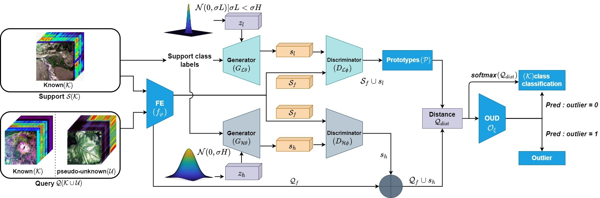
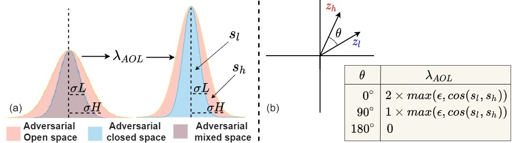
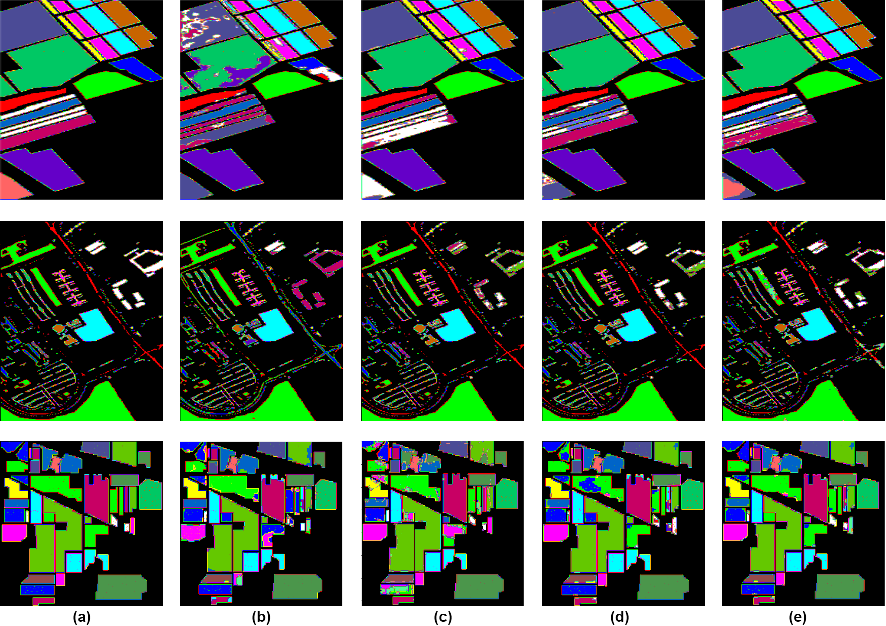

# Meta-learning-based Open-set Recognition via Generative Adversarial Network (MORGAN)

The code repository for "MORGAN: Meta-Learning-based Few-Shot Open-Set Recognition via Generative Adversarial Network" [[paper]](https://openaccess.thecvf.com/content/WACV2023/html/Pal_MORGAN_Meta-Learning-Based_Few-Shot_Open-Set_Recognition_via_Generative_Adversarial_Network_WACV_2023_paper.html) (WACV'23) in Tensorflow. 

### Abstract

In few-shot open-set recognition (FSOSR) for hyperspectral images (HSI), one major challenge arises due to the simultaneous presence of spectrally fine-grained known classes and outliers. Prior research on generative FSOSR cannot handle such a situation due to their inability to approximate the open space prudently. To address this issue, we propose a method, Meta-learning-based Open-set Recognition via Generative Adversarial Network (MORGAN), that can learn a finer separation between the closed and the open spaces. MORGAN seeks to generate class-conditioned adversarial samples for both the closed and open spaces in the few-shot regime using two GANs by judiciously tuning noise variance while ensuring discriminability using a novel Anti-Overlap Latent (AOL) regularizer. Adversarial samples from low noise variance amplify known class data density, and we use samples from high noise variance to augment known-unknowns. A first-order episodic strategy is adapted to ensure stability in the GAN training. Finally, we introduce a combination of metric losses which push these augmented known-unknowns or outliers to disperse in the open space while condensing known class distributions. Extensive experiments on four benchmark HSI datasets indicate that MORGAN achieves state-of-the-art FSOSR performance consistently.

### MORGAN Architecture

First, Feature extractor produces support features for the known classes and query features for a combination of known and pseudo-unknown classes. Then, an adversarial process optimizes a latent vector sampled from isotropic Gaussian to produce pseudo-known features, which is augmented with support features to enrich the closed-set distribution, and prototypes are computed. To enrich open space, we augment query features with pseudo-unknown samples obtained by sampling another Gaussian noise with high noise variance. Outlier detector classifies a query from augmented query set as an outlier based on its Euclidean distance from prototypes. For known query prediction, we obtain its class by applying softmax over query distance.

### Anti-overlap latent regularizer

In MORGAN, one generator with input as a high noise variance vector produces pseudo-unknown samples to enrich the open space. Similarly, another generator with input as a low noise variance vector produces pseudo-known samples to enrich the closed space. Then, to disentangle these adversarial outliers (pseudo-unknown samples) from pseudo-known samples, we define AOL regularizer. 

## Prerequisites

The following packages are required to run the scripts:

- [Tensorflow 2.8.0](https://www.tensorflow.org/)
- [opencv 4.1.2](https://pypi.org/project/opencv-python/)
- [numpy 1.21.5](https://numpy.org/)
- [scipy 1.4.1](https://scipy.org/)
- [sklearn 1.0.2](https://scikit-learn.org/stable/)
- [matplotlib 3.2.2](https://matplotlib.org/)

## Dataset

### Indian Pines, Salinas, Pavia University
Download from (http://www.ehu.eus/ccwintco/index.php/Hyperspectral_Remote_Sensing_Scenes) 

### Houston-2013
Download from (https://hyperspectral.ee.uh.edu/?page_id=459)

## Source Code
The codes for meta-training, fine-tuning and meta-testing on benchmark Hyperspectral Indian Pines dataset is available in Src folder with name as "MORGAN.ipynb".  The code is configured for 3-way 5-shot open-set recognition. 
 
 
## Open-Set Recognition result

Comparison of 5-shot FSOSR classification maps by SOTA methods, namely b) PEELER (c) SnaTCHer (d) OCN, and proposed (e) MORGAN over (Top) Salinas (Middle) University of Pavia and (Bottom) Indian Pines. The ground truth is shown in (a) for each dataset with the open classes annotated in ‘White’ color.  

## Citation
If you use any content of this repo for your work, please cite the following bib entry:

	@InProceedings{Pal_2023_WACV,
    author    = {Pal, Debabrata and Bose, Shirsha and Banerjee, Biplab and Jeppu, Yogananda},
    title     = {MORGAN: Meta-Learning-Based Few-Shot Open-Set Recognition via Generative Adversarial Network},
    booktitle = {Proceedings of the IEEE/CVF Winter Conference on Applications of Computer Vision (WACV)},
    month     = {January},
    year      = {2023},
    pages     = {6295-6304}
	}

## Licence
MORGAN is released under the MIT license. 

Copyright (c) 2023 Debabrata Pal. All rights reserved.
